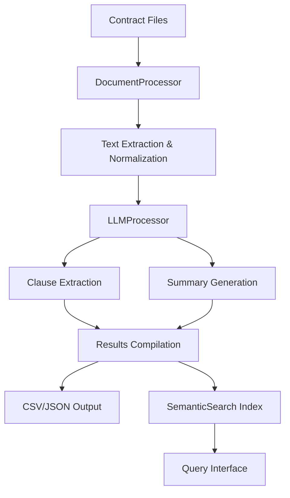

# Legal Contract Processing Pipeline with LLMs

A comprehensive solution for analyzing legal contracts using Large Language Models (LLMs) to extract key clauses and generate summaries. This pipeline processes CUAD (Contract Understanding Atticus Dataset) contracts and similar legal documents.

## Features

🔍 **Intelligent Clause Extraction**: Automatically identifies and extracts termination, confidentiality, and liability clauses
📋 **Contract Summarization**: Generates concise 100-150 word summaries highlighting key terms and obligations  
🚀 **Robust Document Processing**: Handles both PDF and DOCX files with fallback mechanisms
🔎 **Semantic Search**: Optional semantic search over extracted clauses using embeddings (Bonus feature)
⚡ **Few-shot Learning**: Utilizes few-shot examples to improve extraction accuracy
📊 **Comprehensive Output**: Produces both CSV and JSON outputs with detailed metadata

## Architecture Overview



## Installation

### Prerequisites
- Python 3.8+
- OpenAI API key (for LLM processing)

### Setup

1. **Clone the repository**
   ```bash
   git clone https://github.com/Garima-Sangwan/AI-Powered-Contract-Analysis-Using-LLMs
   cd legal-contract-processor
   ```

2. **Install dependencies**
   ```bash
   pip install -r requirements.txt
   ```

3. **Download NLTK data** (automatically handled on first run)
   ```python
   import nltk
   nltk.download('punkt')
   nltk.download('stopwords')
   ```

4. **Set up OpenAI API key**
   ```bash
   export OPENAI_API_KEY="your-api-key-here" #you can use your own
   ```
   Or create a `.env` file:
   ```
   OPENAI_API_KEY=your-api-key-here
   ```

## Usage

### Basic Usage

Process contracts from a directory:

```bash
python contract_processor.py --data_dir /path/to/cuad/contracts --api_key your-openai-key
```

### Advanced Usage

```bash
# Process specific number of contracts with custom output
python contract_processor.py \
    --data_dir ./contracts \
    --output my_analysis.csv \
    --max_contracts 25 \
    --model gpt-4 \
    --api_key your-key

# Skip semantic search index building
python contract_processor.py \
    --data_dir ./contracts \
    --no_search \
    --api_key your-key
```

### Programmatic Usage

```python
from contract_processor import ContractProcessingPipeline

# Initialize pipeline
pipeline = ContractProcessingPipeline(api_key="your-key")

# Process contracts
contracts = pipeline.run(
    data_dir="./contracts",
    output_file="analysis.csv",
    max_contracts=50
)

# Use semantic search
results = pipeline.search_clauses("termination notice period", k=5)
```

## Data Format

### Input
- **PDF files**: Legal contracts in PDF format
- **DOCX files**: Legal contracts in Word document format
- **Directory structure**: All contract files in a single directory

### Output

**CSV Format** (`contract_analysis.csv`):
```csv
contract_id,filename,summary,termination_clause,confidentiality_clause,liability_clause,text_length,word_count
contract_001,agreement1.pdf,"This service agreement...",Either party may terminate...,Each party agrees to maintain...,IN NO EVENT SHALL...,15420,2234
```

**JSON Format** (`contract_analysis.json`):
```json
[
  {
    "contract_id": "contract_001",
    "filename": "agreement1.pdf",
    "summary": "This service agreement establishes terms...",
    "termination_clause": "Either party may terminate this agreement...",
    "confidentiality_clause": "Each party agrees to maintain in confidence...",
    "liability_clause": "IN NO EVENT SHALL EITHER PARTY BE LIABLE...",
    "text_length": 15420,
    "word_count": 2234,
    "full_text": "SAMPLE CONTRACT TEXT...",
    "metadata": {
      "processed_at": "2025-08-07T10:30:45",
      "text_length": 15420,
      "word_count": 2234
    }
  }
]
```

## Key Components

### 1. DocumentProcessor
- **PDF Extraction**: Uses PyMuPDF (fitz) with PyPDF2 fallback
- **Text Normalization**: Cleans and standardizes contract text
- **Batch Processing**: Efficient loading of multiple contracts

### 2. LLMProcessor  
- **Prompt Engineering**: Optimized prompts for legal document analysis
- **Few-shot Learning**: Pre-loaded examples improve extraction accuracy
- **Error Handling**: Robust error handling and retry logic
- **Token Management**: Efficient handling of large documents

### 3. SemanticSearch (Bonus)
- **Embedding Generation**: Uses Sentence Transformers for semantic embeddings
- **FAISS Indexing**: Fast similarity search over extracted clauses
- **Query Interface**: Natural language search over contract clauses

## Prompt Engineering Strategy

### Clause Extraction
- **Few-shot examples**: Each clause type includes representative examples
- **Structured instructions**: Clear, numbered instructions for consistent output
- **Context limitation**: Truncates long documents to fit token limits
- **Temperature control**: Low temperature (0.1) for consistent extraction

### Summarization
- **Focused prompts**: Specific guidance on summary content and length
- **Key elements**: Emphasizes purpose, obligations, risks, and penalties
- **Optimal temperature**: Balanced temperature (0.3) for natural summaries

## Performance Optimization

### Text Processing
- **Efficient PDF extraction**: Primary and fallback extraction methods
- **Text normalization**: Removes noise while preserving legal language
- **Memory management**: Processes documents individually to manage memory

### LLM Usage
- **Batch processing**: Processes multiple clauses per contract efficiently
- **Token optimization**: Truncates input while preserving essential content
- **Error recovery**: Graceful handling of API failures and rate limits

### Semantic Search
- **Normalized embeddings**: Uses cosine similarity for better results
- **Efficient indexing**: FAISS for fast similarity search
- **Metadata tracking**: Comprehensive tracking of clause sources

## Testing

Run the test suite:
```bash
pytest tests/
```

Test specific components:
```bash
pytest tests/test_document_processor.py -v
```

## Project Structure

```
legal-contract-processor/
├── contract_processor.py      # Main pipeline implementation
├── requirements.txt          # Python dependencies  
├── README.md                # Documentation
├── tests/                   # Test suite
│   ├── test_document_processor.py
│   ├── test_llm_processor.py
│   └── test_semantic_search.py
├── examples/                # Usage examples
│   ├── sample_contracts/    # Sample contract files
│   └── example_usage.py     # Example scripts
├── data/                    # Data directory (not included)
│   └── cuad_contracts/      # CUAD dataset contracts
└── outputs/                 # Generated outputs
    ├── contract_analysis.csv
    ├── contract_analysis.json
    └── contract_processing.log
```

## Configuration Options

### Command Line Arguments
- `--data_dir`: Directory containing contract files (required)
- `--output`: Output filename (default: contract_analysis.csv)
- `--max_contracts`: Maximum contracts to process (default: 50)
- `--api_key`: OpenAI API key
- `--model`: LLM model to use (default: gpt-3.5-turbo)
- `--no_search`: Skip semantic search index building

### Environment Variables
- `OPENAI_API_KEY`: OpenAI API key
- `CONTRACT_DATA_DIR`: Default contracts directory
- `LOG_LEVEL`: Logging level (DEBUG, INFO, WARNING, ERROR)

## Evaluation Metrics

The pipeline includes built-in evaluation capabilities:

### Accuracy Metrics
- **Clause Detection Rate**: Percentage of contracts with successfully extracted clauses
- **Summary Quality**: Word count adherence and content completeness
- **Processing Success Rate**: Percentage of successfully processed contracts

### Performance Metrics  
- **Processing Speed**: Contracts processed per minute
- **Token Efficiency**: Average tokens used per contract
- **Memory Usage**: Peak memory consumption during processing

## Troubleshooting

### Common Issues

1. **PDF Extraction Fails**
   ```
   Error: No text extracted from contract.pdf
   ```
   - **Solution**: Check if PDF is text-based (not scanned images)
   - **Alternative**: Use OCR preprocessing for scanned documents

2. **OpenAI API Errors**
   ```
   Error: Rate limit exceeded
   ```
   - **Solution**: Implement retry logic or use a different model tier
   - **Alternative**: Switch to Azure OpenAI for higher limits

3. **Memory Issues**
   ```
   MemoryError: Unable to allocate array
   ```
   - **Solution**: Process contracts in smaller batches
   - **Alternative**: Use streaming processing for large files

### Performance Tips

1. **Optimize batch size** based on available memory
2. **Use GPU-accelerated FAISS** for large-scale semantic search
3. **Cache embeddings** to avoid recomputation
4. **Parallel processing** for independent contract analysis


### Development Guidelines
- Follow PEP 8 style guidelines
- Add comprehensive docstrings
- Write unit tests for new features
- Update documentation for API changes


## Acknowledgments

- **CUAD Dataset**: Contract Understanding Atticus Dataset for legal contract analysis
- **OpenAI**: For providing robust LLM APIs
- **Sentence Transformers**: For high-quality semantic embeddings
- **Legal Community**: For advancing automated contract analysis research


## Contact

For questions, issues, or collaboration opportunities:
- Create an issue in this repository
- Email: garimasangwan909@gmail.com
- LinkedIn: https://www.linkedin.com/in/garimasangwan99/

---

**Note**: This implementation is for educational and research purposes. Always consult with legal professionals for production use cases involving legal document analysis.
